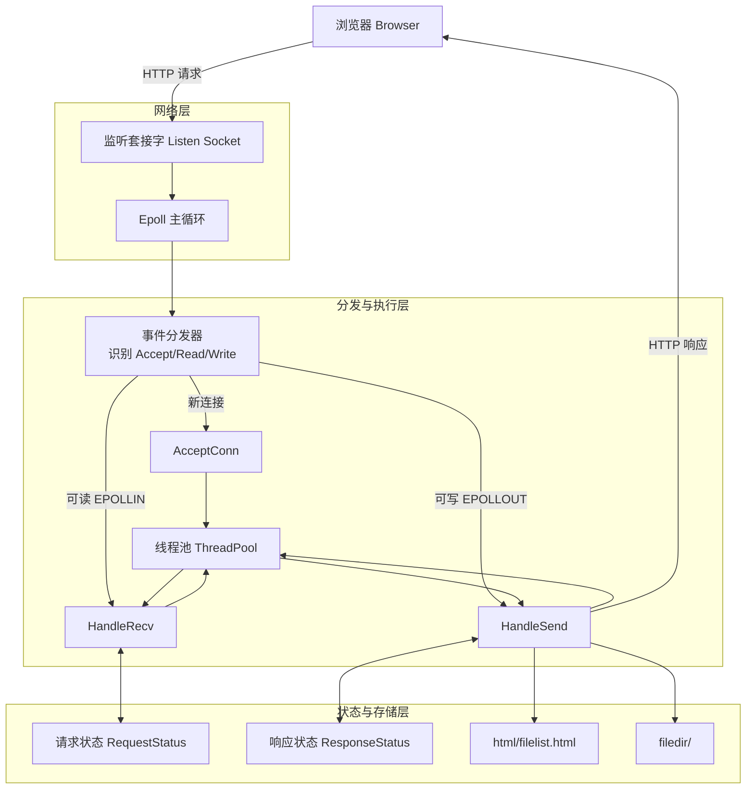
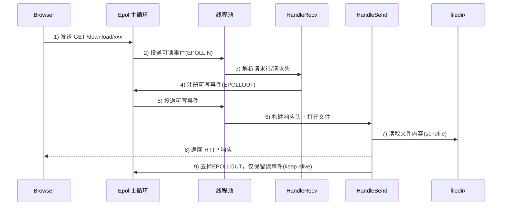

# WebFileServer

一个基于 C++ 的轻量级文件服务器示例，采用 `epoll + 非阻塞 I/O + 线程池 + 状态机` 架构，支持文件列表展示、上传、下载和删除。

> 适合用于学习 Linux 网络编程、事件驱动模型、HTTP 报文处理与并发事件分发。

## 功能特性

- 文件列表页面展示（HTML 模板动态插入文件项）。
- 文件上传（`multipart/form-data`）。
- 文件下载（支持 URL 文件名解码）。
- 文件删除。
- 基于 `Connection: keep-alive` 的连接复用。
- 非阻塞收发与分阶段状态保存，支持“未收完/未发完下次继续”。

## 架构总览



### 请求时序（一次 GET 下载）



## 处理流程

1. 主线程在 `epoll_wait` 中监听监听套接字和客户端套接字事件。
2. 监听到事件后，封装为事件对象（`AcceptConn`/`HandleRecv`/`HandleSend`）并投递线程池。
3. 工作线程调用 `process()` 执行具体逻辑：
   - `HandleRecv` 负责解析请求行、请求头、请求体。
   - `HandleSend` 根据 URL 路由构建响应并发送（HTML/文件/重定向）。
4. 通过连接级状态表保存处理进度，确保非阻塞场景下可断点续处理。
5. 成功完成后保留连接读事件继续复用；异常时关闭连接并清理状态。

## 目录结构

```text
WebFileServer/
├─ WebFileServer-main/
│  ├─ main.cpp
│  ├─ makefile
│  ├─ fileserver/
│  │  ├─ fileserver.h
│  │  └─ fileserver.cpp
│  ├─ threadpool/
│  │  ├─ threadpool.h
│  │  └─ threadpool.cpp
│  ├─ event/
│  │  ├─ myevent.h
│  │  └─ myevent.cpp
│  ├─ message/
│  │  └─ message.h
│  ├─ utils/
│  │  ├─ utils.h
│  │  └─ utils.cpp
│  ├─ html/
│  │  └─ filelist.html
│  └─ filedir/            # 上传文件存储目录
└─ README.md
```

## 模块说明

### `main.cpp`

程序入口，按顺序完成：

- 创建 `WebServer`。
- 创建线程池。
- 创建并监听服务端套接字（默认 `8888` 端口）。
- 初始化 epoll 并进入主循环。

### `fileserver/`

服务框架层，负责网络基础设施与事件分发：

- 套接字初始化（`socket/bind/listen`）。
- epoll 初始化与事件监听。
- 事件识别并投递线程池。

### `event/`

业务处理核心：

- `AcceptConn`：处理新连接接入并注册到 epoll。
- `HandleRecv`：解析 HTTP 请求（GET/POST）。
- `HandleSend`：构建并发送响应（文件列表、下载、删除、重定向）。
- 包含 URL 解码工具，用于下载时处理编码文件名。

### `message/`

请求/响应模型与状态定义：

- `Request`：记录方法、资源、头字段、上传解析状态等。
- `Response`：记录状态行、响应头、消息体、发送进度等。
- 枚举定义了处理阶段与消息体类型。

### `threadpool/`

并发执行层：

- 事件队列 + 互斥锁 + 信号量。
- 主线程生产事件，工作线程消费事件并执行 `process()`。

### `utils/`

通用工具函数：

- 日志前缀输出。
- epoll add/mod/del 封装。
- fd 非阻塞设置。

### `html/` 与 `filedir/`

- `html/filelist.html`：前端文件列表模板。
- `filedir/`：上传、下载、删除操作的目标目录。

### 展示


## 已知限制

- 当前主要面向教学示例，HTTP 语义支持范围有限。
- 缺少统一的优雅退出流程（线程池销毁路径可进一步完善）。
- 请求安全性校验仍有增强空间。

