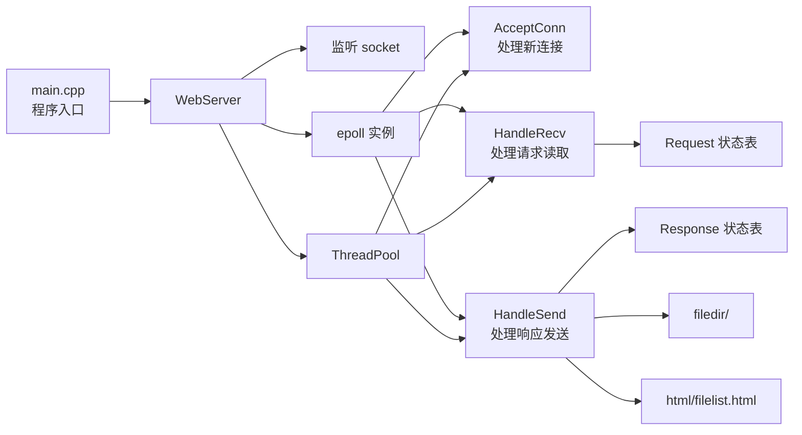
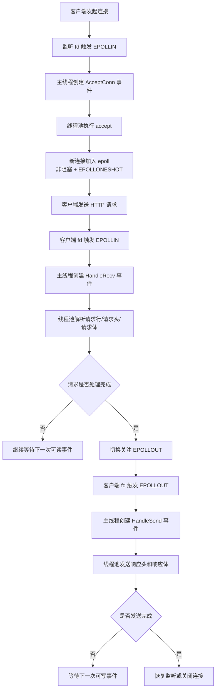
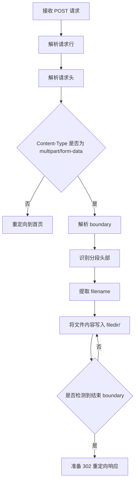

# WebFileServer

一个基于 `C++11`、`epoll`、非阻塞 socket 和线程池实现的轻量级 Web 文件服务器。项目提供浏览器端文件列表展示、文件上传、文件下载、文件删除等能力，适合作为 Linux 网络编程、I/O 多路复用和 Reactor 风格事件处理的学习型项目。

## 项目简介

该项目启动后会监听 `8888` 端口，对外提供一个简单的 HTTP 文件管理页面。用户可以通过浏览器访问服务器首页，查看 `filedir/` 目录下的文件，并完成以下操作：

- 上传文件到服务器目录
- 下载服务器上的指定文件
- 删除服务器上的指定文件
- 浏览服务器当前文件列表

项目整体采用“主线程负责 `epoll` 事件分发，工作线程负责具体事件处理”的设计思路，核心链路清晰，便于理解高并发服务器的基本构建方式。

## 功能特性

- 基于 `epoll` 的事件驱动模型
- 使用非阻塞 socket 处理网络连接
- 使用线程池异步处理连接、读写事件
- 支持 HTTP `GET` 请求
- 支持基于 `multipart/form-data` 的 HTTP `POST` 文件上传
- 支持文件列表页面动态渲染
- 支持文件下载
- 支持文件删除
- 支持 `EPOLLONESHOT`，避免同一连接被多个线程重复处理
- 支持简单运行时统计日志输出
- 支持通过环境变量调整线程池大小

## 技术栈与依赖

- 语言标准：`C++11`
- 网络模型：`socket + epoll`
- 并发模型：`pthread + semaphore`
- 文件发送：`sendfile`
- 目标平台：Linux

> 项目使用了 `epoll`、`arpa/inet.h`、`unistd.h`、`sendfile` 等 Linux/POSIX 接口，因此不适用于原生 Windows 环境直接编译运行。

## 目录结构

```text
WebFileServer-main/
├── event/              # 事件处理模块：连接接入、请求接收、响应发送
├── filedir/            # 服务器文件存储目录
├── fileserver/         # WebServer 封装：监听 socket、epoll、线程池调度
├── html/               # HTML 页面模板
├── message/            # HTTP 请求/响应数据结构
├── threadpool/         # 线程池实现
├── utils/              # epoll 辅助函数、日志、运行统计
├── main.cpp            # 程序入口
└── makefile            # 编译脚本
```

## 核心架构设计

### 1. 总体架构

项目采用典型的 Reactor 风格简化实现：

- 主线程负责初始化服务、创建监听 socket、创建 `epoll` 实例，并在事件循环中等待就绪事件
- 当监听 socket、客户端 socket 出现可读/可写事件时，主线程将事件封装为具体任务对象
- 线程池中的工作线程从任务队列取出事件对象并执行 `process()`
- 请求状态和响应状态以“连接 fd -> 状态对象”的形式保存在共享容器中

### 2. 架构图



## 请求处理流程

### 1. 整体请求生命周期



### 2. 上传请求流程

浏览器上传文件时，请求通过 `POST /upload` 提交，服务端按如下方式处理：



### 3. 下载/删除流程

- `GET /`：渲染文件列表页面
- `GET /download/<filename>`：打开目标文件，构造响应头后通过 `sendfile` 发送文件内容
- `GET /delete/<filename>`：删除目标文件后返回 `302` 重定向到首页
- 其他路径：统一按重定向逻辑返回首页

## 模块说明

### `main.cpp`

程序入口，负责按顺序完成以下初始化：

- 解析线程池大小
- 创建线程池
- 创建监听 socket
- 创建 `epoll`
- 将监听 fd 加入 `epoll`
- 进入事件循环

线程池大小可通过以下环境变量控制：

- `THREAD_POOL_SIZE`：直接指定线程数
- `THREAD_POOL_MODE=2x` 或 `double`：按 CPU 核数的 2 倍创建线程

### `fileserver/`

`WebServer` 类负责封装服务器基础设施：

- `createListenFd()`：创建、绑定、监听 socket
- `createEpoll()`：创建 `epoll` 实例
- `epollAddListenFd()`：将监听 fd 注册到 `epoll`
- `createThreadPool()`：创建线程池
- `waitEpoll()`：主事件循环，负责等待事件并分发任务

这一层相当于整个服务端的调度中枢。

### `event/`

事件模块定义了三类核心任务对象，均继承自 `EventBase`：

- `AcceptConn`：处理新连接接入，执行 `accept`，设置非阻塞并加入 `epoll`
- `HandleRecv`：接收并解析 HTTP 请求，维护请求状态，识别 GET/POST 行为
- `HandleSend`：根据响应状态构造并发送 HTTP 响应，支持 HTML 页面、文件下载和重定向

该模块是业务逻辑最集中的部分。

### `message/`

定义 HTTP 请求与响应的数据结构：

- `Message`：公共基类，包含处理状态和头部字段
- `Request`：保存请求行、请求头、请求体缓存、上传文件名、文件上传状态等信息
- `Response`：保存响应头、响应体、文件描述符、发送进度等信息

同时还定义了多个状态枚举：

- `MSGSTATUS`：消息处理阶段
- `MSGBODYTYPE`：响应体类型
- `FILEMSGBODYSTATUS`：上传文件体解析阶段

### `threadpool/`

线程池模块负责：

- 创建多个工作线程
- 使用任务队列缓存待处理事件
- 使用互斥锁保护队列
- 使用信号量通知工作线程有新任务到来

工作线程循环从队列中取出 `EventBase` 对象并调用其 `process()` 完成处理。

### `utils/`

工具模块提供以下能力：

- `epoll_ctl` 相关封装：添加、修改、删除监听 fd
- 设置 fd 为非阻塞模式
- 简单日志输出封装
- 运行时统计指标累积与周期性汇总

### `html/`

保存文件列表页模板 `filelist.html`。服务端在返回首页时会读取模板，并把 `filedir/` 中的文件名动态插入到表格中。

### `filedir/`

作为服务端文件存储目录：

- 上传文件默认写入该目录
- 下载文件默认从该目录读取
- 删除文件默认从该目录移除

## HTTP 路由约定

当前项目采用较简化的路径分发方式：

| 请求方法 | 路径示例 | 功能 |
| --- | --- | --- |
| `GET` | `/` | 显示文件列表页 |
| `POST` | `/upload` | 上传文件 |
| `GET` | `/download/test.txt` | 下载指定文件 |
| `GET` | `/delete/test.txt` | 删除指定文件 |

## 状态管理设计

项目用两个共享哈希表维护连接级别状态：

- `requestStatus`：保存某个客户端 fd 当前的请求解析进度
- `responseStatus`：保存某个客户端 fd 当前的响应发送进度

这样做的好处是：

- 能够支持分阶段解析请求报文
- 能够支持非阻塞发送下的断点续传式发送
- 便于把“读事件处理”和“写事件处理”拆分到不同任务中

同时，项目使用互斥锁保护这些共享状态，降低多线程访问冲突风险。

## 编译与运行

### 1. 编译

在 Linux 环境下进入项目目录后执行：

```bash
make
```

默认会生成可执行文件：

```bash
./main
```

如果希望手动编译，可参考：

```bash
g++ -std=c++11 main.cpp ./fileserver/fileserver.cpp ./threadpool/threadpool.cpp ./event/myevent.cpp ./utils/utils.cpp -lpthread -o main
```

### 2. 运行

```bash
./main
```

服务默认监听：

```text
0.0.0.0:8888
```

浏览器访问：

```text
http://127.0.0.1:8888/
```

### 3. 调整线程池大小

示例：

```bash
THREAD_POOL_SIZE=8 ./main
```

或：

```bash
THREAD_POOL_MODE=2x ./main
```

## 关键实现说明

### 1. 为什么使用 `EPOLLONESHOT`

客户端连接 fd 在加入 `epoll` 时启用了 `EPOLLONESHOT`，这样同一个连接在某个时刻只会被一个工作线程处理，避免多个线程同时操作同一个 socket 或同一份请求/响应状态。

### 2. 为什么读写分离

请求接收和响应发送分别由 `HandleRecv` 与 `HandleSend` 处理，便于：

- 清晰组织状态机
- 更好适配非阻塞 IO
- 在请求解析完成后再切换为可写关注

### 3. 文件下载为什么使用 `sendfile`

下载文件时直接调用 `sendfile` 发送文件内容，可以减少用户态和内核态之间的数据拷贝，适合静态文件发送场景。

## 日志与运行统计

项目提供简单日志与运行统计能力，运行中会输出类似以下维度的信息：

- `epoll_wakeups`
- `epoll_events`
- `dispatched`
- `accept_ok`
- `recv_events`
- `send_events`
- `error_logs`
- `queue_pending`

这有助于观察服务在一段时间窗口内的事件处理情况。

## 当前实现的特点与局限

### 优点

- 结构清晰，适合作为网络编程学习项目
- 展示了 `epoll + 线程池 + 非阻塞 IO` 的基本组合方式
- 具备完整的“接入 -> 解析 -> 分发 -> 响应”闭环
- 包含上传、下载、删除等可感知功能，便于演示

### 局限

- HTTP 协议解析较为简化，未完整覆盖复杂场景
- 路由规则依赖字符串拆分，扩展性有限
- 缺少更严格的路径安全校验
- 未实现 MIME 类型识别、断点续传、权限控制等高级能力
- 目前更适合作为教学/练手项目，而不是直接投入生产

## 可继续优化的方向

- 增加 `README` 中的接口测试示例，例如 `curl` 上传/下载命令
- 增加配置文件，支持自定义端口、根目录、日志等级
- 增加 URL 路径安全校验，防止目录穿越
- 增加更完整的 HTTP 状态码与错误页处理
- 增加单元测试和压力测试脚本
- 支持多文件上传、断点续传和更完整的文件元数据展示
- 优化 HTML 模板和前端交互体验

## 适用场景

- Linux 网络编程课程设计
- C/C++ 高性能服务器入门练习
- `epoll`、线程池、HTTP 报文解析学习
- 文件服务器原型验证

## Private cloud upgrade

The server now supports:

- `/register` for new account creation
- `/login` for authentication
- `/logout` for session cleanup
- per-user storage under `filedir/<username>/`
- login-gated upload, download, delete, and file listing

User records are stored in `data/users.db`, and login state is tracked with an in-memory session cookie.

## License

如果你准备将该项目开源到 GitHub，建议补充一个明确的开源许可证，例如 `MIT`、`Apache-2.0` 或 `GPL-3.0`，方便他人合法使用和贡献代码。

